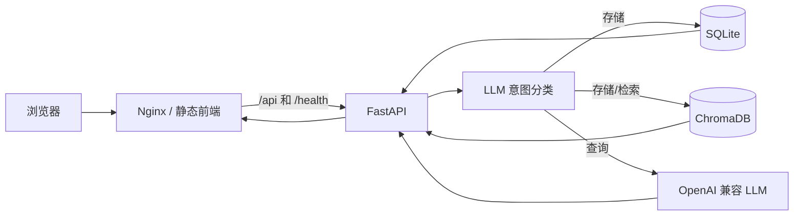

# Pensieve Memory Agent

一个带长期记忆能力的轻量 Web 智能体。用户可以保存自然语言记忆，也可以用模糊问题检索历史内容。SQLite 保存权威原始数据，ChromaDB 提供语义召回，OpenAI 兼容接口负责意图识别和回答整理。

> 当前版本已提供账户注册、登录、注销和 Bearer Session，并在 SQLite 与 ChromaDB 层按 `user_id` 隔离。公网部署仍必须配置 HTTPS、限流、备份和受控 CORS。

## 技术栈

| 层级 | 技术 | 用途 |
| --- | --- | --- |
| 前端 | HTML、CSS、原生 JavaScript | 单页聊天和记忆管理界面 |
| API | Python 3.11、FastAPI、Uvicorn | HTTP API 与流程编排 |
| 结构化存储 | SQLite | 原始记忆权威数据 |
| 语义检索 | ChromaDB、all-MiniLM-L6-v2 | 本地向量化和相似度检索 |
| AI | OpenAI Python SDK | 调用 OpenAI 兼容模型服务 |
| 部署 | Docker Compose、Nginx | 容器运行、静态页面和反向代理 |

## 架构



- `frontend/index.html`：浏览器界面。
- `backend/main.py`：认证 API、记忆 API 和流程编排。
- `backend/auth.py`：密码哈希和不透明 Session Token。
- `backend/database.py`：用户、Session、对话、消息和记忆的 SQLite 数据访问。
- `backend/vector_store.py`：ChromaDB 索引和召回。
- `backend/llm_service.py`：模型客户端、意图分类和回答生成。
- SQLite 是可备份的权威数据；ChromaDB 是可通过重建接口恢复的派生索引。

## 快速开始：Docker Compose（推荐）

需要 Docker Engine 24+ 和 Docker Compose v2。

```bash
cd memory-agent
cp backend/.env.example backend/.env
# 编辑 backend/.env，填入真实 OPENAI_API_KEY
docker compose up -d --build
docker compose ps
```

浏览器访问 `http://服务器地址:8080`。健康检查地址为 `http://服务器地址:8080/health`。

数据保存在名为 `memory_data` 的 Docker volume 中。升级时不要使用 `docker compose down -v`，否则会删除该数据卷。

## 本地运行：不使用 Docker

要求 Python 3.11 或 3.12。前端不需要 Node.js，也没有 npm 构建步骤。

```bash
cd memory-agent/backend
python -m venv .venv
```

Linux/macOS：

```bash
source .venv/bin/activate
pip install -r requirements.txt
cp .env.example .env
python init_db.py
uvicorn main:app --host 127.0.0.1 --port 8001
```

Windows PowerShell：

```powershell
.venv\Scripts\Activate.ps1
pip install -r requirements.txt
Copy-Item .env.example .env
python init_db.py
python -m uvicorn main:app --host 127.0.0.1 --port 8001 --reload
```

### 开发服务启动核对

必须先进入 `memory-agent/backend` 再启动。`main:app` 是按当前工作目录导入的；从其他目录启动可能加载另一个同名模块或旧代码。

Windows PowerShell 启动前可检查 8001 是否被旧进程占用：

```powershell
netstat -ano | Select-String ':8001'
```

如果显示 `LISTENING`，先确认 PID 对应的是本项目旧 Uvicorn，再停止它：

```powershell
Get-Process -Id <PID> | Select-Object Id,ProcessName,Path,StartTime
Stop-Process -Id <PID>
```

不要在未确认进程身份时批量终止所有 Python 进程。启动后必须验证实际加载版本，而不只是确认端口已监听：

```powershell
$schema = Invoke-RestMethod http://127.0.0.1:8001/openapi.json
$schema.info.version
$schema.paths.PSObject.Properties.Name
```

当前多用户版本应返回 `0.2.0`，并包含：

```text
/api/auth/register
/api/auth/login
/api/auth/logout
```

开发环境使用 `--reload` 可以在源码变化后自动重载。生产环境禁止使用 `--reload`，应重新构建并替换容器：

```bash
docker compose down
docker compose build --no-cache
docker compose up -d
```

另开终端，在项目根目录启动静态页面：

```bash
python -m http.server 8080 --directory frontend
```

本地页面与 API 不同源时，可用 `http://localhost:8080/?apiBase=http://localhost:8001` 访问。

## 测试

开发测试依赖单独维护：

```bash
pip install -r backend/requirements-dev.txt
python -m pytest backend -q -p no:cacheprovider
```

测试不会调用真实 LLM。测试覆盖注册、登录状态、注销、数据库隔离、向量隔离和跨用户越权。

## 生产部署注意事项

- 部署前轮换曾写入 Git 的 API Key，并从 Git 历史、镜像和日志中清理旧密钥。
- 不要提交 `.env`、`memory.db`、`chroma_data` 或任何真实记忆。
- 账户使用不透明 Bearer Session Token；生产入口必须使用 HTTPS，避免 Token 被窃听。
- `POST /api/memory/rebuild` 只重建当前认证用户的索引。
- 外部只开放 Nginx 的 HTTPS 端口，不直接开放后端和数据目录。
- 为 `memory_data` 建立定期备份。SQLite 是首要备份对象，Chroma 索引可以重建。
- 首次语义检索可能下载嵌入模型；服务器需要临时网络访问和足够磁盘空间。生产环境宜预热并缓存模型。
- SQLite 与本地 ChromaDB 更适合单后端实例。本配置刻意使用一个 Uvicorn worker；不要直接水平扩容。
- 注册和登录接口尚无应用内限流，必须在外层网关限制频率。
- 设置容器 CPU、内存、磁盘、日志轮转和 LLM 费用告警。
- 正式环境应在外层配置 TLS、访问日志、安全响应头、限流和请求体大小限制。

完整部署步骤见根目录 [DEPLOYMENT.md](DEPLOYMENT.md)，上线前逐项执行 [部署检查清单](docs/DEPLOYMENT_CHECKLIST.md)。冻结范围和遗留风险见 [部署前冻结报告](DEPLOYMENT_FREEZE_REPORT.md)。
