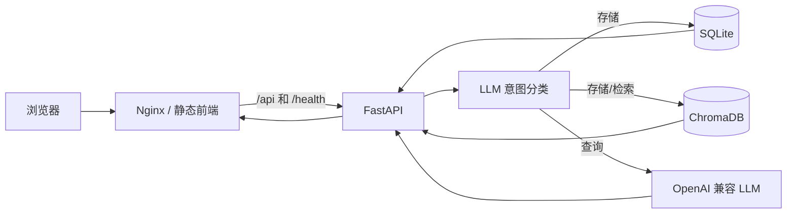

# Pensieve Memory Agent

一个带长期记忆能力的轻量 Web 智能体。用户可以保存自然语言记忆，也可以用模糊问题检索历史内容。SQLite 保存权威原始数据，ChromaDB 提供语义召回，OpenAI 兼容接口负责意图识别和回答整理。

> 当前版本已提供账户注册、登录、注销和 Bearer Session，并在 SQLite 与 ChromaDB 层按 `user_id` 隔离。公网部署仍必须配置 HTTPS、限流、备份和受控 CORS。

## 技术栈

| 层级 | 技术 | 用途 |
| --- | --- | --- |
| 前端 | HTML、CSS、原生 JavaScript | 单页聊天和记忆管理界面 |
| API | Python 3.11、FastAPI、Uvicorn | HTTP API 与流程编排 |
| 结构化存储 | SQLite | 原始记忆权威数据 |
| 语义检索 | ChromaDB、all-MiniLM-L6-v2 | 本地向量化和相似度检索 |
| AI | OpenAI Python SDK | 调用 OpenAI 兼容模型服务 |
| 部署 | Docker Compose、Nginx | 容器运行、静态页面和反向代理 |

## 架构



- `frontend/index.html`：浏览器界面。
- `backend/main.py`：认证 API、记忆 API 和流程编排。
- `backend/auth.py`：密码哈希和不透明 Session Token。
- `backend/database.py`：用户、Session、对话、消息和记忆的 SQLite 数据访问。
- `backend/vector_store.py`：ChromaDB 索引和召回。
- `backend/llm_service.py`：模型客户端、意图分类和回答生成。
- SQLite 是可备份的权威数据；ChromaDB 是可通过重建接口恢复的派生索引。
- 相对日期在写入时按记忆自身的 `created_at` 和 `APP_TIMEZONE` 固化到 `memory_date_mentions`；月历和时间问答复用同一结构化日期索引。带日期的问题先做日期硬过滤，再在候选内进行语义排序。

## 快速开始：Docker Compose（推荐）

需要 Docker Engine 24+ 和 Docker Compose v2。

```bash
cd memory-agent
cp backend/.env.example backend/.env
# 编辑 backend/.env，填入真实 OPENAI_API_KEY
docker compose up -d --build
docker compose ps
```

浏览器访问 `http://服务器地址:8080`。健康检查地址为 `http://服务器地址:8080/health`。

数据保存在名为 `memory_data` 的 Docker volume 中。升级时不要使用 `docker compose down -v`，否则会删除该数据卷。

## Windows 本地开发

要求 Python 3.11 或 3.12。前端是纯 HTML/JavaScript，不需要 Node.js。为避免从错误目录
加载同名模块、遗留旧 Uvicorn 或让前端连到错误实例，Windows 开发只使用以下脚本，不再分别
手动运行 Uvicorn 和 `http.server`。

### 一键启动与关闭

日常使用流程：

1. 双击项目根目录的 `启动 Pensieve.cmd`。
2. 等待脚本完成后端、前端和跨域通信检查。
3. 检查通过后，浏览器会自动打开 Pensieve 页面。
4. 使用结束后，双击项目根目录的 `关闭 Pensieve.cmd`。

启动窗口如果报告失败会保持打开，请根据其中显示的端口、进程和日志信息排查。关闭入口只会
停止由一键启动功能记录且身份校验通过的 Pensieve 进程，不会批量结束其他 Python 或 Node 进程。

### 首次准备

在 `memory-agent` 目录执行：

```powershell
python -m venv .\backend\.venv
.\backend\.venv\Scripts\python.exe -m pip install -r .\backend\requirements.txt
Copy-Item .\backend\.env.example .\backend\.env  # 仅在 .env 尚不存在时执行
# 编辑 backend\.env，配置 OPENAI_API_KEY 等变量
.\backend\.venv\Scripts\python.exe .\backend\init_db.py  # 仅在 memory.db 不存在时执行
```

不要覆盖已有 `.env` 或 `memory.db`。

### 标准启动

从项目根目录 `memory-agent` 运行：

```powershell
powershell -NoProfile -ExecutionPolicy Bypass -File .\scripts\start-dev.ps1
```

`-ExecutionPolicy Bypass` 只作用于本次新 PowerShell 进程，不会永久降低系统执行策略，也不需要
运行 `Set-ExecutionPolicy Unrestricted`。如果当前终端已允许执行本地脚本，也可直接运行：

```powershell
.\scripts\start-dev.ps1
```

脚本固定检查 8001 和 8080，不会自动换端口或结束占用者。启动成功后会打印最终 API Base、
前端 URL、后端版本、实际加载模块、数据库绝对路径和 PID。浏览器必须使用脚本打印的 URL，
不要直接双击 `frontend/index.html`。

日志写入 `logs/dev/`，PID 与启动身份记录写入 `.dev-runtime/dev-state.json`；两者均被 Git 忽略。

### 标准停止

```powershell
powershell -NoProfile -ExecutionPolicy Bypass -File .\scripts\stop-dev.ps1
```

停止脚本会同时核对 PID 和进程启动时间，只停止 `start-dev.ps1` 本次记录的前后端进程。它不会
按进程名称批量停止 Python、Node 或 Uvicorn。

### 一键诊断

```powershell
powershell -NoProfile -ExecutionPolicy Bypass -File .\scripts\diagnose-dev.ps1
```

诊断输出包括端口与进程身份、健康检查、实际后端版本、Python/Node 版本、虚拟环境、数据库、
API Base、状态文件及最新日志位置。

需要单独验证实际服务的 CORS 预检和响应头时运行：

```powershell
powershell -NoProfile -ExecutionPolicy Bypass -File .\scripts\test-cors.ps1
# 也可验证 localhost 来源：
powershell -NoProfile -ExecutionPolicy Bypass -File .\scripts\test-cors.ps1 -Origin http://localhost:8080
```

脚本会输出 8001 监听进程、后端版本、OPTIONS 预检以及带 Origin 的真实 GET 响应头；验证失败时返回非零退出码。

### 重复启动冒烟测试

发布本地启动脚本修改前，可执行五轮真实启动、健康检查与停止：

```powershell
powershell -NoProfile -ExecutionPolicy Bypass -File .\scripts\smoke-dev.ps1 -Cycles 5
```

冒烟脚本会从系统临时目录调用项目脚本，逐轮核对 IPv4、`localhost`、OpenAPI 版本、数据库
绝对路径、端口和状态文件，并确认数据库 SHA-256 未改变。

### 常见故障

- **提示虚拟环境不存在**：执行“首次准备”中的 venv 和依赖安装命令，不要让项目隐式使用系统 Python。
- **提示 8001 或 8080 被占用**：先查看脚本输出的 PID、完整命令行及
  `LooksLikeCurrentProject`。若它是状态文件记录的本项目实例，运行 `stop-dev.ps1`；否则从占用它的
  应用中停止。不要批量结束所有 Python 进程。
- **后端启动后立即退出**：`start-dev.ps1` 会直接显示后端错误，同时保留
  `logs/dev/backend-*.error.log`。先修复日志中的导入、依赖、环境变量或数据库权限错误。
- **遗留 PID 文件**：下次启动会校验 PID 与启动时间；两端进程都不存在时会自动移除过期状态。
- **前端提示版本不匹配**：运行 `diagnose-dev.ps1`，确认 `/api/health` 的版本、PID 和命令行都来自
  当前项目。
- **需要自定义 API Base**：启动前设置 `$env:MEMORY_AGENT_API_BASE`，或向脚本传递 `-ApiBase`。
  地址仍必须是明确的本机 HTTP 根地址，脚本不会扫描或选择其他端口。

`scripts/start-local.ps1` 仅保留为旧命令兼容别名，新文档和日常开发统一使用 `start-dev.ps1`。

## 测试

开发测试依赖单独维护：

```bash
pip install -r backend/requirements-dev.txt
python -m pytest backend -q -p no:cacheprovider
```

测试不会调用真实 LLM。测试覆盖注册、登录状态、注销、数据库隔离、向量隔离和跨用户越权。

历史日期索引升级前应备份数据，然后先预览、再分批回填：

```bash
python backend/backfill_date_mentions.py --dry-run --batch-size 1000
python backend/backfill_date_mentions.py --batch-size 50
```

完整迁移语义、幂等性和回滚建议见 `docs/DEPLOYMENT.md` 的“日期索引升级与历史回填”。

## 生产部署注意事项

- 部署前轮换曾写入 Git 的 API Key，并从 Git 历史、镜像和日志中清理旧密钥。
- 不要提交 `.env`、`memory.db`、`chroma_data` 或任何真实记忆。
- 账户使用不透明 Bearer Session Token；生产入口必须使用 HTTPS，避免 Token 被窃听。
- `POST /api/memory/rebuild` 只重建当前认证用户的索引。
- 外部只开放 Nginx 的 HTTPS 端口，不直接开放后端和数据目录。
- 为 `memory_data` 建立定期备份。SQLite 是首要备份对象，Chroma 索引可以重建。
- 首次语义检索可能下载嵌入模型；服务器需要临时网络访问和足够磁盘空间。生产环境宜预热并缓存模型。
- SQLite 与本地 ChromaDB 更适合单后端实例。本配置刻意使用一个 Uvicorn worker；不要直接水平扩容。
- 注册和登录接口尚无应用内限流，必须在外层网关限制频率。
- 设置容器 CPU、内存、磁盘、日志轮转和 LLM 费用告警。
- 正式环境应在外层配置 TLS、访问日志、安全响应头、限流和请求体大小限制。

完整部署步骤见根目录 [DEPLOYMENT.md](DEPLOYMENT.md)，上线前逐项执行 [部署检查清单](docs/DEPLOYMENT_CHECKLIST.md)。冻结范围和遗留风险见 [部署前冻结报告](DEPLOYMENT_FREEZE_REPORT.md)。
