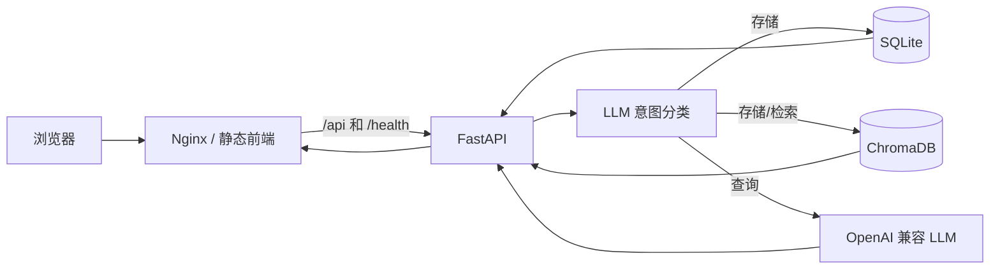

# Pensieve Memory Agent

一个带长期记忆能力的轻量 Web 智能体。用户可以保存自然语言记忆，也可以用模糊问题检索历史内容。SQLite 保存权威原始数据，ChromaDB 提供语义召回，OpenAI 兼容接口负责意图识别和回答整理。

> 当前项目适合单用户或可信内网部署。它尚未提供登录、API 鉴权和多用户数据隔离，不应未经额外安全保护直接作为多用户公网服务开放。

## 技术栈

| 层级 | 技术 | 用途 |
| --- | --- | --- |
| 前端 | HTML、CSS、原生 JavaScript | 单页聊天和记忆管理界面 |
| API | Python 3.11、FastAPI、Uvicorn | HTTP API 与流程编排 |
| 结构化存储 | SQLite | 原始记忆权威数据 |
| 语义检索 | ChromaDB、all-MiniLM-L6-v2 | 本地向量化和相似度检索 |
| AI | OpenAI Python SDK | 调用 OpenAI 兼容模型服务 |
| 部署 | Docker Compose、Nginx | 容器运行、静态页面和反向代理 |

## 架构



- `frontend/index.html`：浏览器界面。
- `backend/main.py`：API 路由和记忆流程编排。
- `backend/database.py`：SQLite 数据访问。
- `backend/vector_store.py`：ChromaDB 索引和召回。
- `backend/llm_service.py`：模型客户端、意图分类和回答生成。
- SQLite 是可备份的权威数据；ChromaDB 是可通过重建接口恢复的派生索引。

## 快速开始：Docker Compose（推荐）

需要 Docker Engine 24+ 和 Docker Compose v2。

```bash
cd memory-agent
cp backend/.env.example backend/.env
# 编辑 backend/.env，填入真实 OPENAI_API_KEY
docker compose up -d --build
docker compose ps
```

浏览器访问 `http://服务器地址:8080`。健康检查地址为 `http://服务器地址:8080/health`。

数据保存在名为 `memory_data` 的 Docker volume 中。升级时不要使用 `docker compose down -v`，否则会删除该数据卷。

## 本地运行：不使用 Docker

要求 Python 3.11 或 3.12。前端不需要 Node.js，也没有 npm 构建步骤。

```bash
cd memory-agent/backend
python -m venv .venv
```

Linux/macOS：

```bash
source .venv/bin/activate
pip install -r requirements.txt
cp .env.example .env
python init_db.py
uvicorn main:app --host 127.0.0.1 --port 8001
```

Windows PowerShell：

```powershell
.venv\Scripts\Activate.ps1
pip install -r requirements.txt
Copy-Item .env.example .env
python init_db.py
uvicorn main:app --host 127.0.0.1 --port 8001
```

另开终端，在项目根目录启动静态页面：

```bash
python -m http.server 8080 --directory frontend
```

本地页面与 API 不同源时，可用 `http://localhost:8080/?apiBase=http://localhost:8001` 访问。

## 测试

开发测试依赖单独维护：

```bash
pip install -r backend/requirements-dev.txt
python -m pytest backend -q -p no:cacheprovider
```

测试不会调用真实 LLM，但现有配置测试期望 `MODEL_NAME=qwen-plus`。使用其他模型时应先取消外部环境变量或让测试环境使用示例配置。

## 生产部署注意事项

- 部署前轮换曾写入 Git 的 API Key，并从 Git 历史、镜像和日志中清理旧密钥。
- 不要提交 `.env`、`memory.db`、`chroma_data` 或任何真实记忆。
- 当前没有认证与用户隔离。公网部署前，应在反向代理或独立认证层限制访问。
- 仅允许可信管理员执行 `POST /api/memory/rebuild`。
- 外部只开放 Nginx 的 HTTPS 端口，不直接开放后端和数据目录。
- 为 `memory_data` 建立定期备份。SQLite 是首要备份对象，Chroma 索引可以重建。
- 首次语义检索可能下载嵌入模型；服务器需要临时网络访问和足够磁盘空间。生产环境宜预热并缓存模型。
- SQLite 与本地 ChromaDB 更适合单后端实例。本配置刻意使用一个 Uvicorn worker；不要直接水平扩容。
- 设置容器 CPU、内存、磁盘、日志轮转和 LLM 费用告警。
- 正式环境应在外层配置 TLS、访问日志、安全响应头、限流和请求体大小限制。

完整部署步骤见根目录 [DEPLOYMENT.md](DEPLOYMENT.md)，上线前逐项执行 [部署检查清单](docs/DEPLOYMENT_CHECKLIST.md)。冻结范围和遗留风险见 [部署前冻结报告](DEPLOYMENT_FREEZE_REPORT.md)。
